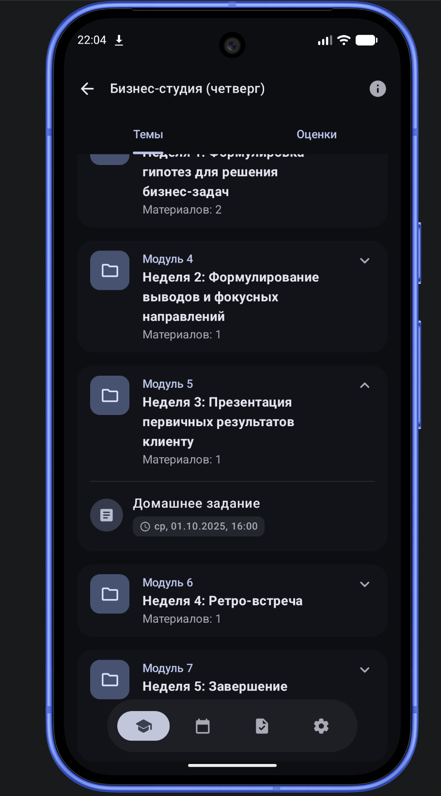

# CU Hub

Это неофициальное приложение lms Центрального университета.
На данный момент пока в активной разработке и всё ещё дописывается.
Ниже по пунктам расписано, что реализовано и что планируется дописать:

## Бэклог

### LMS

* [x] Список курсов
* [x] Детали курса

    * [x] Оценки
    * [x] Материалы
    * [x] Задачи
    * [x] Дедлайны
* [x] Просмотр материалов
* [x] Фоновая загрузка материалов
* [x] Просмотр архивных курсов
* [ ] Просмотр уведомлений внутри платформы
* [ ] Детальный просмотр заданий
* [ ] Прикрепление домашних работ
* [ ] Зачётка

### Календарь

* [x] Интеграция через CalDAV
* [x] Генерация повторяющихся событий
* [ ] Детальный просмотр события
* [ ] Фоновая синхронизация
* [ ] Уведомления о новых событиях
* [ ] Интерактивная карта с кабинетами

### Задания

* [x] Просмотр заданий по неделям
* [x] Фильтрация по дням
* [x] Фильтрация по статусам
* [ ] Фильтрация по курсам
* [ ] Уведомления о новых заданиях

### Настройки

> Пока функциональность не реализована.

* [ ] Детали аккаунта
* [ ] Смена темы
* [ ] Смена языка

### Авторизация

* [x] Авторизация

    * [x] Заменить моковую авторизацию на реальную

## Экраны

### Главный экран


На главном экране находится `Pager` со всеми категориями курсов, а также быстрый доступ к
уведомлениям и архивным курсам.

### Курсы


Раздел со списком курсов и основной информацией по ним.



В деталях курса доступны основные сведения о курсе, оценки, материалы и связанные задания.

### Оценки


Просмотр оценок пользователя по курсам.

### Материалы


Просмотр материалов курса.


Поддерживается просмотр различных типов материалов и переход к их деталям.

### Задания


Список заданий с группировкой по времени и текущим статусом.

### Фильтры


Для заданий доступны фильтры.


Можно комбинировать параметры фильтрации.

### Архивные курсы


Отдельный экран для просмотра завершённых и архивных курсов.

## Техническая часть

### Стек

Проект пока только на android, но планирую в будущем переписать на KMP. Ниже использованный стек:

- Jetpack Compose
- Room
- Ktor
- Dagger 2
- Navigation 3
- Direct (моя библиотека для удобной реализации mvi)
- ical4j (парсер iCal файлов)
- jsoup (построение html дерева)
- Yandex Auth Mobile SDK
- Mokk
- Turbine
- Arrow

### Архитектура

В этом проекте используется стандартная модульная архитектура с разделением на `api` и `impl` для
feature модулей. Бизнес логика в основном вынесена в UseCase, а данные приходят из репозиториев.

#### Структура модулей:

```text
app/
└── ...

build-logic/
└── ...

core/
├── lms/
│   ├── data/
│   ├── domain/
│   ├── ui/
│   ├── background/ # фоновые задачи и синхронизация 
│
├── network/
├── di/
├── ui
├── navigation
├── domain
└── ... # др утилитарные модули

feature/
├── feature1/
│   ├── api/
│   ├── impl/
└── ...
```

### Тестирование

Пока тестами покрыты только основные функции работы с календарём, и ещё есть парочку тестов для
viewModel. Когда будет готова mvp, то планирую сделать больше тестов(особенно ui).

#### Запуск тестов

```shell
./gradlew test
```

### Сборка

Чтобы не загромождать файлы gradle написал convention плагины. Для этого создал модуль, который
добавил в основную сборку через:

```kotlin
includeBuild("build-logic")
```

Этот подмодуль собирается перед основной сборкой. Все плагины имеют вот такой вид:

```kotlin
class MyPlugin : Plugin<Project> {
    override fun apply(target: Project) {
        with(target) {
            TODO()
        }
    }
}
```

Все общие конфигурации вынесены в отдельные фалы.

Дебаг версия собирается с помощью следующей командой:

```shell
./gradlew assembleDebug
```

Перед сборкой нужно добавить в `local.properties` поле `YANDEX_CLIENT_ID` с идентификатором
приложения в Яндекс ID. Без этого приложение не соберётся.